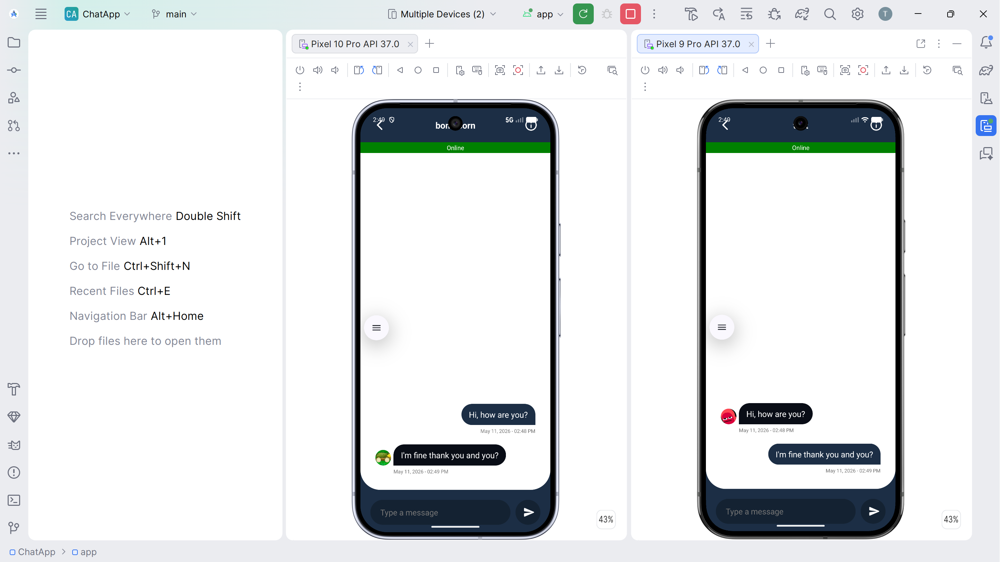

## ChatApp
An Android-based conversation application built using Java in Android Studio, with Firebase as the backend service. It provides real-time messaging, secure authentication, and cloud-hosted data storage to deliver a smooth and reliable chat experience.

## Features
1. Sign In & Sign Up Using Firestore
2. Sign Out
3. Display User List
4. RealTime Chat
5. Recent Conversations
6. User Availability
7. Notification

## Demo
[](https://github.com/zilitye/ChatApp/releases/download/v1.0.0/app-release.apk)

Install and run `app-release.apk` requires Android 5.0 or higher



## How To Use
1. Create a Firebase Project

2. Download the `google-services.json` file from your Firebase project.

3. Navigate to Project Settings.

4. Select the Service Account tab.

5. Click on Generate New Private Key to download the `service_account.json` file.

6. Place `google-services.json` it inside your app’s `app/` directory in Android Studio.

7. [Download Node Js Project for generate Authorization token](https://file.preptm.com/Content//editor/firebase-node-project.zip)

8. Replace the placeholder `service_account.json` file with the one you downloaded. Add `./` before filename

9. Install required packages 

```npm install google-auth-library```

10. Run the script

```node index.js```

11. Copy the Firebase access token and paste into `Constants.java`